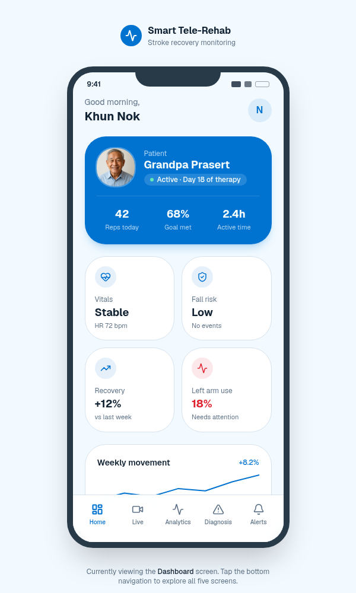
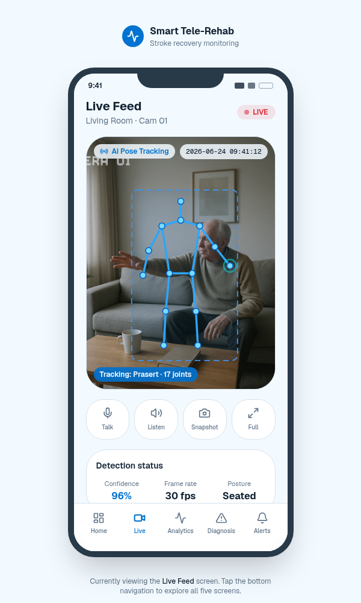
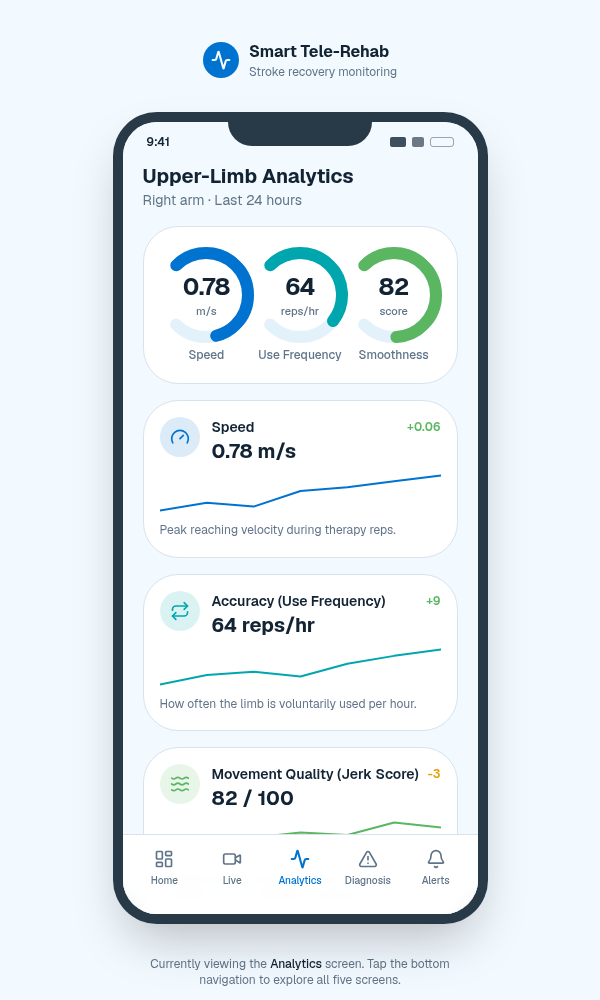
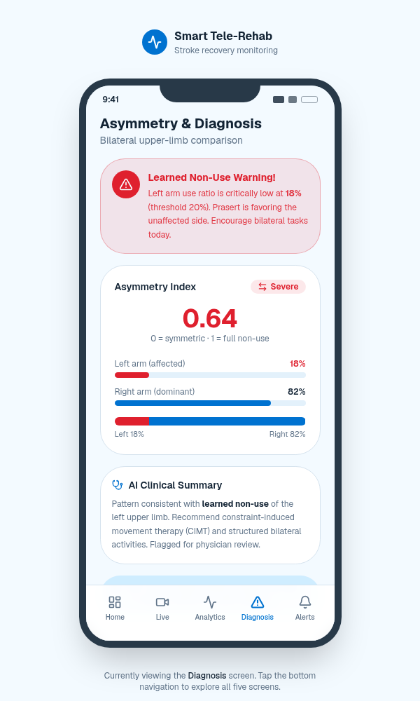
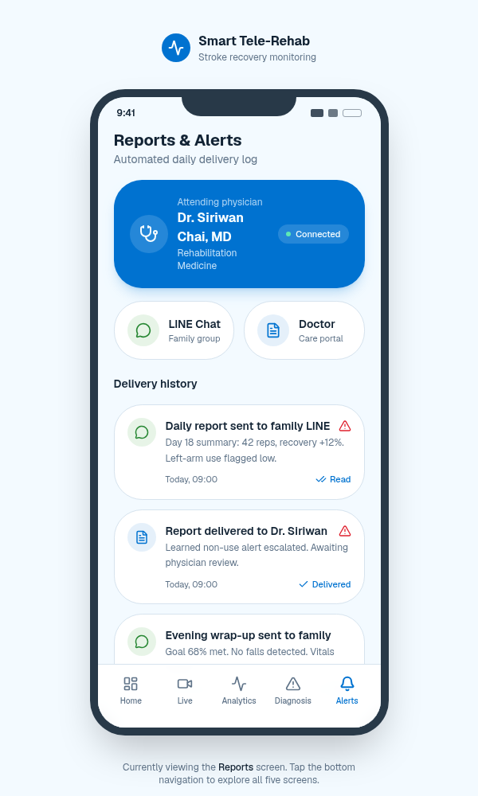

# AI-Powered CCTV Passive Monitoring for Learned Non-Use Screening
**Digital Aiding 4 Aging Hackathon 2026**

### 💡 พลิกโจทย์นวัตกรรม
เปลี่ยนการประเมินรยางค์ส่วนบนแบบเดิมที่ต้องมานั่งทำท่าตามสั่ง (Active Assessment) ซึ่งฝืนธรรมชาติและสร้างความเครียดให้ผู้สูงอายุ มาสู่ระบบ **Passive ADL Monitoring** ผ่านการดึงสตรีมภาพกล้องวงจรปิด (CCTV) ในบ้านขณะผู้ป่วยใช้ชีวิตประจำวันจริง (ทานข้าว, แปรงฟัน) 

### 🛠️ ไฮไลต์ทางเทคนิค (Technical Core)
1. **Shoulder-Distance Normalization**: แก้ไขปัญหามุมกล้องวงจรปิดมุมสูงและระยะใกล้-ไกล โดยใช้ระยะห่างระหว่างไหล่สองข้างเป็นหน่วยวัดอ้างอิงสรีระแทนค่าพิกเซลหน้าจอ
2. **Motion Biomarkers**: คำนวณความเร็ว (Speed) อัตราการเลือกใช้งานจริง (Use Ratio) และคะแนนความลื่นไหลผ่านความเร่งสะดุด (Jerk/Smoothness Analysis)
3. **Connected Care Alert**: สรุปผลสัมฤทธิ์และยิงสัญญาณเตือนภัยภาวะสมองลืมใช้แขน (Learned Non-Use) เข้าแอปพลิเคชัน LINE ของแพทย์และญาติแบบ Real-time ผ่าน LINE Notify API

## 🎬 วิดีโอนำเสนอผลงาน (Pitching & Demo Video)
👉 [คลิกที่นี่เพื่อรับชมวิดีโอนำเสนอและสาธิตระบบคัดกรอง AI (Google Drive)] (https://drive.google.com/file/d/1AGh87vcJC6CQGJu0K3MM0gAGwRhLUqv0/view?usp=sharing)
*(เนื่องจากปริมาณการจราจรทางเครือข่ายช่วงเช้าหนาแน่น ทีมงานจึงขอนำเสนอวิดีโอสาธิตระบบผ่านช่องทางหลักบน GitHub นี้เพื่อให้คณะกรรมการสามารถรับชมระบบตรวจสอบได้ทันทีครับ)*

## 🎬 presentation (Pitching )
👉 [คลิกที่นี่เพื่อรับชม preseatation นำเสนอ] (https://canva.link/9e16fm2du9ajilo)

### 📱 Mobile App UI Showcase

  
  
  
  
  

